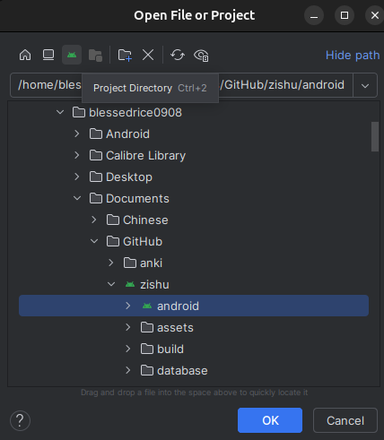
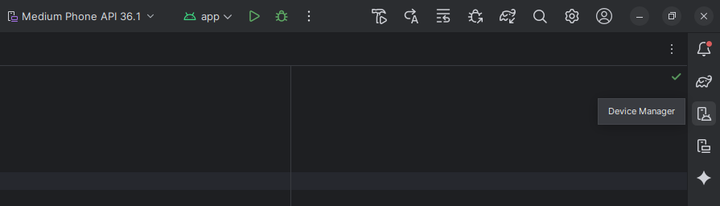
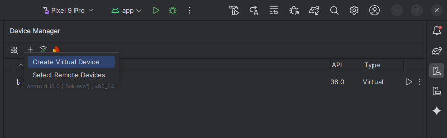
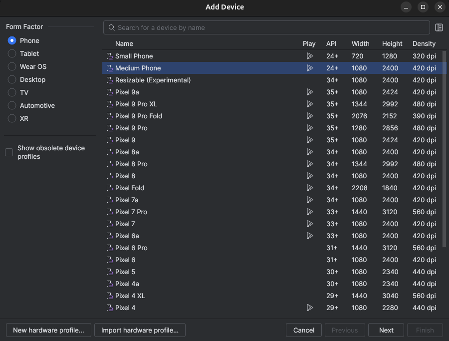
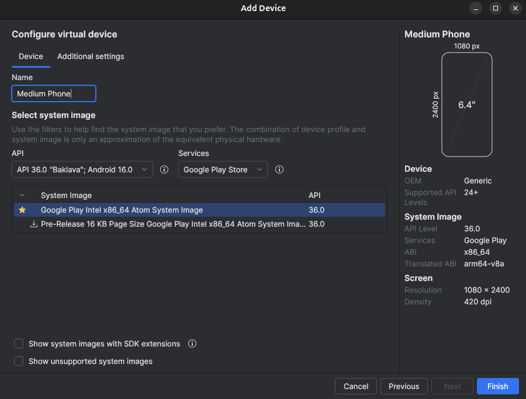
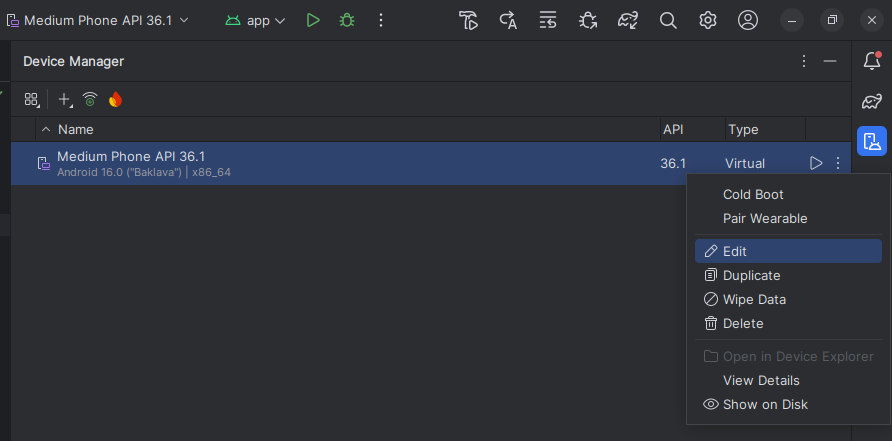
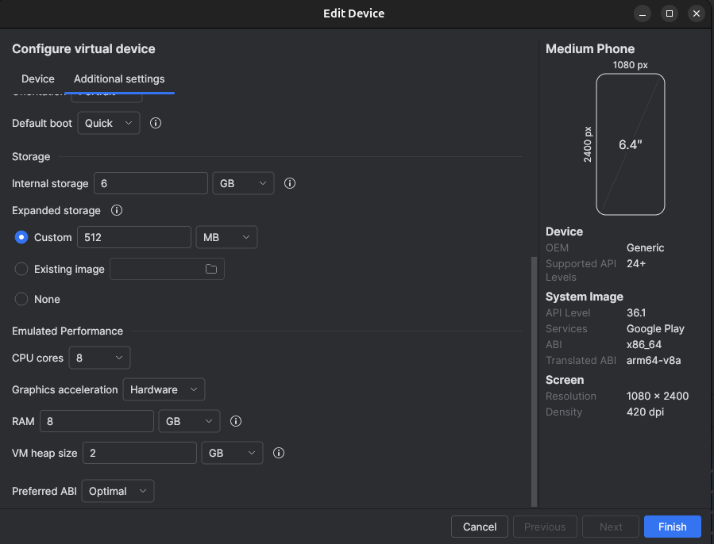

# Developing Zishu on non-IOS

Development on iOS is rather simple; however, some libraries are unavailable on Linux and Windows. This guide should assist in setup for Linux and Windows developers.

## Codebase Setup

Fork Zishu [here](https://github.com/Grosess/zishu/fork) and pull your forked repo onto your local machine.

## Android Studios

Android Studios provides a layer of abstraction and support in terms of package availability. Downloading Android Studios [here](https://developer.android.com/studio) or through another method is required.

Open zishu/android as the directory instead of zishu

## Running an Emulator

On the right side of the screen, click "Device Manager"

Click the `+` sign to add a new emulator

Choose medium phone and click next

Click Finish

## Configuring the Emulator

On the right side of the screen, click "Device Manager"

For your emulator, click the three vertical dots and click "Edit"

Here are some changes that are recommended

- Change Graphics acceleration to Hardware
- Update RAM to 8GB
- Update VM heap size to 2GB

